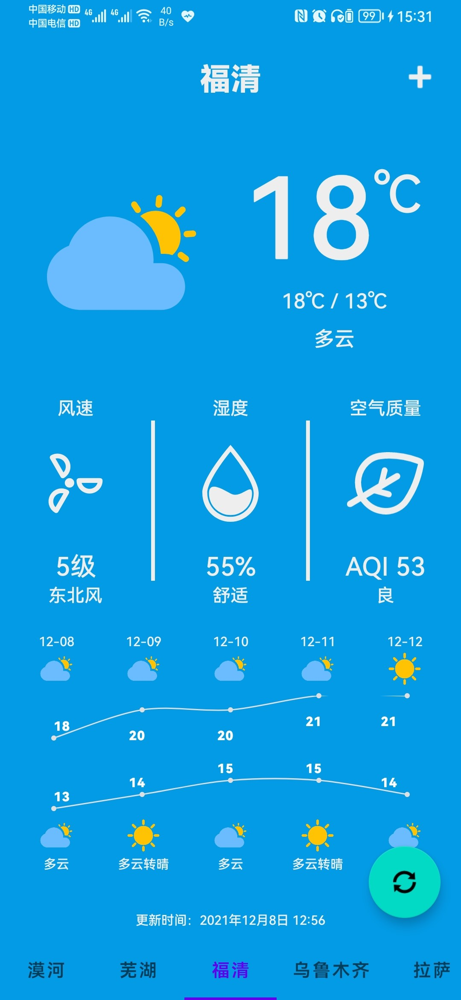

# Android-Application-Weather
重庆大学2019级计算机学院移动应用开发实验四：Android天气应用（天气预报）

Android Studio Chipmunk | 2021.2.1 Patch 1

Gradle Version: 7.0.2

Compile Sdk Version: API 31(Android 12.0)

Dependency:

Android-PickerView:4.1.9

hellocharts-library:1.5.8@aar

天气信息来源：聚合数据天气预报API（请在聚合数据https://www.juhe.cn/docs/api/id/73 申请key并替换app/src/main/java/com/cqu/weather/ui/CityWeatherPage.java第215行中的“******”）

(源码和资源在app/src/main)

#### 实验目的
1.	能够熟练的使用常用组件和布局进行界面设计。
2.	能够使用对话框、菜单、ViewPager、碎片等组件，并能使用RoomDB访问数据库数据，能够从网络获取天气数据。
3.	调试完成APP。

#### 实验内容
完成的软件基本功能包括：（1）能够从网络获取天气信息。（2）能够显示多个城市的天气信息，包括当日天气和将来多日天气；（3）能够通过某种方式更新天气信息。（4）能够动态添加新城市的天气信息。（5）能够在同一界面总览多个城市的天气信息。（6）使用了数据库存储数据。

#### 实验成果
应用主页展示了一座城市的详细天气，包括实时天气、温度、当日最高和最低温、风速、风向、湿度、空气质量指数，以及未来几天的昼夜天气和温度。未来五天的温度趋势用曲线图表示。通过左右滑动或者底部的TabLatout城市栏可以切换展示的城市，切换后页面标题也会变成当前展示的城市，页面的背景颜色会根据当前展示的城市天气进行渐变变化。当添加的城市较多时，底部栏可以左右滑动。

点击右下角的按钮可以从网络获取并刷新当前页的城市天气，成功后有弹窗提示，若联网失败也会有相应提示。点击右上角的加号会弹出添加城市对话框，若添加相同的城市会提示该城市已存在，输入正确的城市并点击添加后，会自动跳转到刚添加的城市页，并自动刷新天气信息。

在主页点击城市标题会跳转到城市列表页，该页展示了已经添加的所有城市以及这些城市的天气和温度。点击某城市卡片左上角的“×”可以删除该城市，长按某城市卡片收到震动反馈后可以拖动该城市进行排序。点击某城市会回到城市天气详情页并跳转到点击的城市。

城市列表和天气信息储存在数据库中。

#### 应用截图
-|-|-
:-------------------------:|:-------------------------:|:-------------------------:
 |  | 
 |  | 
